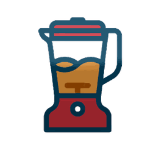

[](../../)
[](../../)
[](../../issues)
[](/LICENSE.md)
[](../../commits/master)
[](../../commits/master)
[](https://pypistats.org/packages/imageedit)
[](https://pepy.tech/project/imageedit)
[](https://pypi.org/project/imageedit)

<!-- omit in toc -->
# ImageEdit


[**Now available on pypi.org!**](https://pypi.org/project/imageedit/)

Create various icon masks and shading effects with the imageedit library.
Six example files under main: round.py, makeProjIcons.py, makePWAImages.py,
makeRetro.py, getPWAScreenshots.py and readWriteLayered.py.

Leverages the following libraries to do the heavy lifting:
```none
pillow
layeredimage
svgtrace
blendmodes
```

Have a look under test/test_readWriteLayered for an example of converting an
xcf to ora and png. Unfortunately, visibility of xcf is currently ignored :(

- [Example Files](#example-files)
- [Comparison to similar solutions](#comparison-to-similar-solutions)
	- [GUI](#gui)
	- [Web](#web)
	- [Advantages of this solution](#advantages-of-this-solution)
	- [Disadvantages of this solution](#disadvantages-of-this-solution)
- [How to use out of the box](#how-to-use-out-of-the-box)
	- [makePWAImages](#makepwaimages)
	- [makeRetro](#makeretro)
- [Documentation](#documentation)
- [Install With PIP](#install-with-pip)
- [Language information](#language-information)
	- [Built for](#built-for)
- [Install Python on Windows](#install-python-on-windows)
	- [Chocolatey](#chocolatey)
	- [Download](#download)
- [Install Python on Linux](#install-python-on-linux)
	- [Apt](#apt)
- [How to run](#how-to-run)
	- [With VSCode](#with-vscode)
	- [From the Terminal](#from-the-terminal)
- [Download Project](#download-project)
	- [Clone](#clone)
		- [Using The Command Line](#using-the-command-line)
		- [Using GitHub Desktop](#using-github-desktop)
	- [Download Zip File](#download-zip-file)
- [Community Files](#community-files)
	- [Licence](#licence)
	- [Changelog](#changelog)
	- [Code of Conduct](#code-of-conduct)
	- [Contributing](#contributing)
	- [Security](#security)
	- [Support](#support)
	- [Rationale](#rationale)


See the documentation for each library for more information on things you
can use it for.

## Example Files
- getPWAScreenshots.py
- makeProjIcons.py
- makePWAImages.py
- makeRetro.py
- readWriteLayered.py
- round.py

## Comparison to similar solutions

Similar solutions include but are not limited to:

### GUI
https://www.getpaint.net/

### Web
https://realfavicongenerator.net/

### Advantages of this solution
- Lightweight: few dependencies required (python, pillow, blendmodes,
layeredimage, and svgtrace)
- Quick: when given a regular or mask image it can produce many
variants in a relatively short amount of time
- Customizable: write your own scripts to leverage imageEdit (python knowledge
required)
- Produce a PWA mask icon out of the box
- SVG tracing lib doesn't require potrace/ pypotrace which can be challenging to
set up on Windows
- SVG tracing using imageTracerJs.py (https://github.com/jankovicsandras/imagetracerjs)
is pretty good (requires pyppeteer: https://github.com/miyakogi/pyppeteer)

### Disadvantages of this solution
- Specific image dimensions needed out of the box: whilst this is something that
could be changed, maskable icons are 640x640 and regular icons are 512x512

## How to use out of the box

### makePWAImages

1. Put regular 512x512 image or mask 640x640 image under main/input in this
example I am using lightfox.png

	

2. Run ```makePWAImages.py``` and navigate to main/output/lightfox.png/pwa

	<div>
	
	
	
	
	
	</div>

### makeRetro
1. Put regular 512x512 image or mask 640x640 image under main/input. In this
   example I am using BlendModes.png

	

2. Run ```makeRetro.py``` and navigate to main/output/blendmodes.png/retro
	Personal Computers

	<div>
	
	
	
	
	</div>

	Mobile Operating Systems

	iOS

	<div>
	
	
	</div>

	Android

	<div>
	
	
	
	
	</div>


## Documentation
See the [Docs](/DOCS.md) for more information.

## Install With PIP
```python
pip install imageedit
```

Head to https://pypi.org/project/imageedit/ for more info

## Language information
### Built for
This program has been written for Python 3 and has been tested with
Python version 3.9.0 <https://www.python.org/downloads/release/python-380/>.

## Install Python on Windows
### Chocolatey
```powershell
choco install python
```
### Download
To install Python, go to <https://www.python.org/> and download the latest
version.

## Install Python on Linux
### Apt
```bash
sudo apt install python3.9
```

## How to run
### With VSCode
1. Open the .py file in vscode
2. Ensure a python 3.9 interpreter is selected (Ctrl+Shift+P > Python:Select
Interpreter > Python 3.9)
3. Run by pressing Ctrl+F5 (if you are prompted to install any modules, accept)
### From the Terminal
```bash
./[file].py
```

## Download Project
### Clone
#### Using The Command Line
1. Press the Clone or download button in the top right
2. Copy the URL (link)
3. Open the command line and change directory to where you wish to
clone to
4. Type 'git clone' followed by URL in step 2
```bash
$ git clone https://github.com/FHPythonUtils/ImageEdit
```

More information can be found at
<https://help.github.com/en/articles/cloning-a-repository>

#### Using GitHub Desktop
1. Press the Clone or download button in the top right
2. Click open in desktop
3. Choose the path for where you want and click Clone

More information can be found at
<https://help.github.com/en/desktop/contributing-to-projects/cloning-a-repository-from-github-to-github-desktop>

### Download Zip File

1. Download this GitHub repository
2. Extract the zip archive
3. Copy/ move to the desired location

## Community Files
### Licence
MIT License
Copyright (c) FredHappyface
(See the [LICENSE](/LICENSE.md) for more information.)

### Changelog
See the [Changelog](/CHANGELOG.md) for more information.

### Code of Conduct
Online communities include people from many backgrounds. The *Project*
contributors are committed to providing a friendly, safe and welcoming
environment for all. Please see the
[Code of Conduct](https://github.com/FHPythonUtils/.github/blob/master/CODE_OF_CONDUCT.md)
 for more information.

### Contributing
Contributions are welcome, please see the
[Contributing Guidelines](https://github.com/FHPythonUtils/.github/blob/master/CONTRIBUTING.md)
for more information.

### Security
Thank you for improving the security of the project, please see the
[Security Policy](https://github.com/FHPythonUtils/.github/blob/master/SECURITY.md)
for more information.

### Support
Thank you for using this project, I hope it is of use to you. Please be aware that
those involved with the project often do so for fun along with other commitments
(such as work, family, etc). Please see the
[Support Policy](https://github.com/FHPythonUtils/.github/blob/master/SUPPORT.md)
for more information.

### Rationale
The rationale acts as a guide to various processes regarding projects such as
the versioning scheme and the programming styles used. Please see the
[Rationale](https://github.com/FHPythonUtils/.github/blob/master/RATIONALE.md)
for more information.
