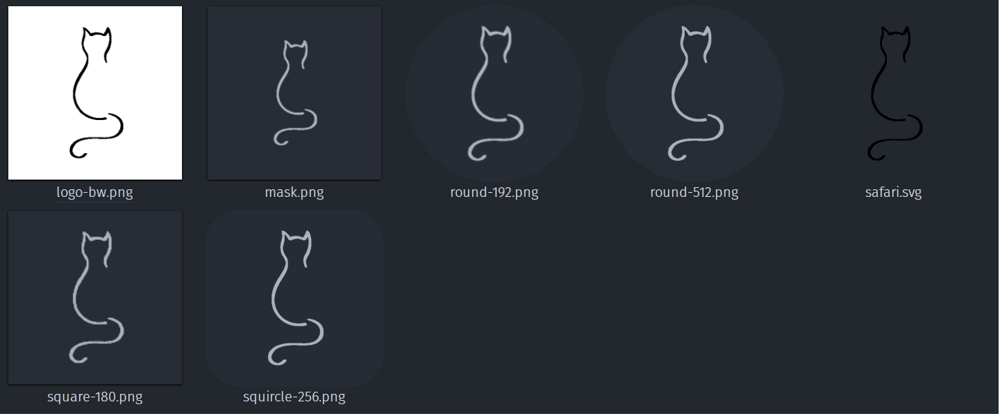
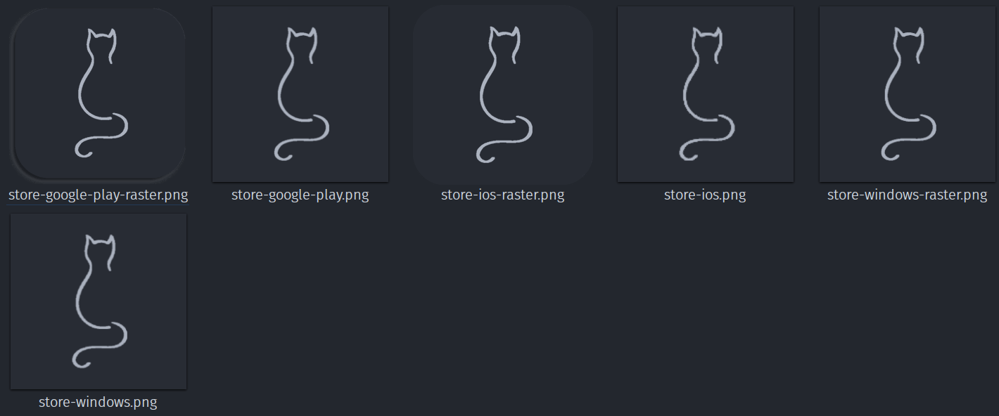
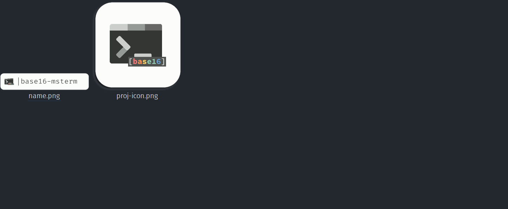

[](../../)
[](https://www.codacy.com/manual/FHPythonUtils/ImageRound)
[](https://www.codacy.com/manual/FHPythonUtils/ImageRound)
[](../../)
[](../../issues)
[](/LICENSE.md)
[](../../commits/master)
[](../../commits/master)
[](https://pypi.org/project/imageedit/)
[](https://pypi.org/project/imageedit/)

<!-- omit in toc -->
# ImageEdit


[**Now available on pypi.org!**](https://pypi.org/project/imageedit/)

Create various icon masks and shading effects with the imageedit library.
Four example files: round.py, makeProjIcons.py, makePWAImages.py and
getPWAScreenshots.py. Includes imagetracer.py. imagetracer.py uses JS and is
much faster than previous implementations. Takes a few seconds and has no cap.

- [Library Files](#library-files)
- [Example Files](#example-files)
- [Comparison to similar solutions](#comparison-to-similar-solutions)
	- [GUI](#gui)
	- [Web](#web)
	- [Advantages of this solution](#advantages-of-this-solution)
	- [Disadvantages of this solution](#disadvantages-of-this-solution)
- [How to use out of the box (makePWAImages)](#how-to-use-out-of-the-box-makepwaimages)
- [Example usage and docs for layered images](#example-usage-and-docs-for-layered-images)
- [Install With PIP](#install-with-pip)
- [Language information](#language-information)
	- [Built for](#built-for)
- [Install Python on Windows](#install-python-on-windows)
	- [Chocolatey](#chocolatey)
	- [Download](#download)
- [Install Python on Linux](#install-python-on-linux)
	- [Apt](#apt)
- [How to run](#how-to-run)
	- [With VSCode](#with-vscode)
	- [From the Terminal](#from-the-terminal)
- [Download](#download-1)
	- [Clone](#clone)
		- [Using The Command Line](#using-the-command-line)
		- [Using GitHub Desktop](#using-github-desktop)
	- [Download Zip File](#download-zip-file)
- [Community Files](#community-files)
	- [Licence](#licence)
	- [Changelog](#changelog)
	- [Code of Conduct](#code-of-conduct)
	- [Contributing](#contributing)
	- [Security](#security)
- [Screenshots](#screenshots)
	- [Desktop](#desktop)

## Library Files
Generate docs with
```bash
pydocmd simple imageedit.effects++ imageedit.imagegrab++ imageedit.imagetracer++ imageedit.io++ imageedit.transform++ > Docs.md
```

See the [Docs](/Docs.md) for more information.
## Example Files
- round.py
- makeProjIcons.py
- makePWAImages.py
- readWriteLayered.py
- getPWAScreenshots.py

## Comparison to similar solutions

Similar solutions include but are not limited to:

### GUI
https://www.getpaint.net/

### Web
https://realfavicongenerator.net/

### Advantages of this solution
- Minimal: few dependencies required (python and pillow)
- Quick: when given a regular or mask image it can produce a large number or
variants in a relatively short amount of time
- Customisable: write your own scripts to leverage imageEdit (python knowledge
required)
- Produce a PWA mask icon out of the box
- SVG tracing lib doesn't require potrace/ pypotrace which can be challenging to
set up on Windows
- SVG tracing using imageTracerJs.py (https://github.com/jankovicsandras/imagetracerjs)
is pretty good (requires pyppeteer: https://github.com/miyakogi/pyppeteer)

### Disadvantages of this solution
- Specific image dimensions needed out of the box: whilst this is something that
could be changed, maskable icons are 640x640 and regular icons are 512x512

## How to use out of the box (makePWAImages)

1. Put regular 512x512 image or mask 640x640 image under main/input in this
example I am using lightfox.png

	

2. Run ```makePWAImages.py``` and navigate to main/output/lightfox.png/pwa

<div>


</div>

## Example usage and docs for layered images

Layered images are supported but offsets are very wonky at this stage. Therefore,
when manually adding and inserting layers, use the `addLayerRaster` and
`insertLayerRaster` functions to add a PIL Image as a layer.

```python
class Layer:
	""" A representation of an image layer """
	def __init__(self, image, name, offsets, opacity, visible, dimensions):
		self.image = image
		self.name = name
		self.offsets = offsets # Doesn't look to be required
		self.opacity = opacity
		self.visible = visible
		self.dimensions = dimensions


class LayeredImage:
	""" A representation of a layered image such as an ora """
	def __init__(self, layers, dimensions):
		self.layers = layers
		self.dimensions = dimensions

	def addLayerRaster(self, image, name, offsets=(0, 0)):
		""" The recommended way to add a layer """

	def insertLayerRaster(self, image, name, index, offsets=(0, 0)):
		""" The recommended way to insert a layer """

	def getLayer(self, index):
		""" Get a layer """

	def addLayer(self, layer):
		""" Add a layer """

	def insertLayer(self, layer, index):
		""" Insert a layer at a specific index """

	def removeLayer(self, index):
		""" Remove a layer at a specific index """

	def getFlattenLayers(self, ignoreHidden=True):
		""" Return an image for all flattened layers """

	def getFlattenTwoLayers(self, background, foreground, ignoreHidden=True):
		""" Return an image for two flattened layers """

	def flattenTwoLayers(self, background, foreground, ignoreHidden=True):
		""" Flatten two layers """

	def flattenLayers(self, ignoreHidden=True):
		""" Flatten all layers """
```

To modify a layer you would need to do something like:
```python
# Grab the PIL Image from a layer and do stuff
layer = layeredImage.getLayer(1).image
crop = imageedit.transform.cropCentre(layer, 100, 100)
# Remove the old layer 1 and raster the new layer 1
layeredImage.removeLayer(1)
layeredImage.insertLayerRaster(crop, "Cropped Layer @1", 1, offsets=(50, 0))
```


## Install With PIP

```python
pip install imageedit
```

Head to https://pypi.org/project/imageedit/ for more info

See python files under main for example usage

## Language information
### Built for
This program has been written for Python 3 and has been tested with
Python version 3.8.0 <https://www.python.org/downloads/release/python-380/>.

## Install Python on Windows
### Chocolatey
```powershell
choco install python
```
### Download
To install Python, go to <https://www.python.org/> and download the latest
version.

## Install Python on Linux
### Apt
```bash
sudo apt install python3.8
```

## How to run
### With VSCode
1. Open the .py file in vscode
2. Ensure a python 3.8 interpreter is selected (Ctrl+Shift+P > Python:Select
Interpreter > Python 3.8)
3. Run by pressing Ctrl+F5 (if you are prompted to install any modules, accept)
### From the Terminal
```bash
./[file].py
```

## Download
### Clone
#### Using The Command Line
1. Press the Clone or download button in the top right
2. Copy the URL (link)
3. Open the command line and change directory to where you wish to clone to
4. Type 'git clone' followed by URL in step 2
```bash
$ git clone https://github.com/[user-name]/[repository]
```


More information can be found at
<https://help.github.com/en/articles/cloning-a-repository>

#### Using GitHub Desktop
1. Press the Clone or download button in the top right
2. Click open in desktop
3. Choose the path for where you want and click Clone

More information can be found at
<https://help.github.com/en/desktop/contributing-to-projects/cloning-a-repository-from-github-to-github-desktop>

### Download Zip File

1. Download this GitHub repository
2. Extract the zip archive
3. Copy/ move to the desired location

## Community Files
### Licence
MIT License
Copyright (c) FredHappyface
(See the [LICENSE](/LICENSE.md) for more information.)

### Changelog
See the [Changelog](/CHANGELOG.md) for more information.

### Code of Conduct
In the interest of fostering an open and welcoming environment, we
as contributors and maintainers pledge to make participation in our
project and our community a harassment-free experience for everyone.
Please see the
[Code of Conduct](https://github.com/FHPythonUtils/.github/blob/master/CODE_OF_CONDUCT.md) for more information.

### Contributing
Contributions are welcome, please see the [Contributing Guidelines](https://github.com/FHPythonUtils/.github/blob/master/CONTRIBUTING.md) for more information.

### Security
Thank you for improving the security of the project, please see the [Security Policy](https://github.com/FHPythonUtils/.github/blob/master/SECURITY.md) for more information.

## Screenshots

### Desktop
<div>



</div>
