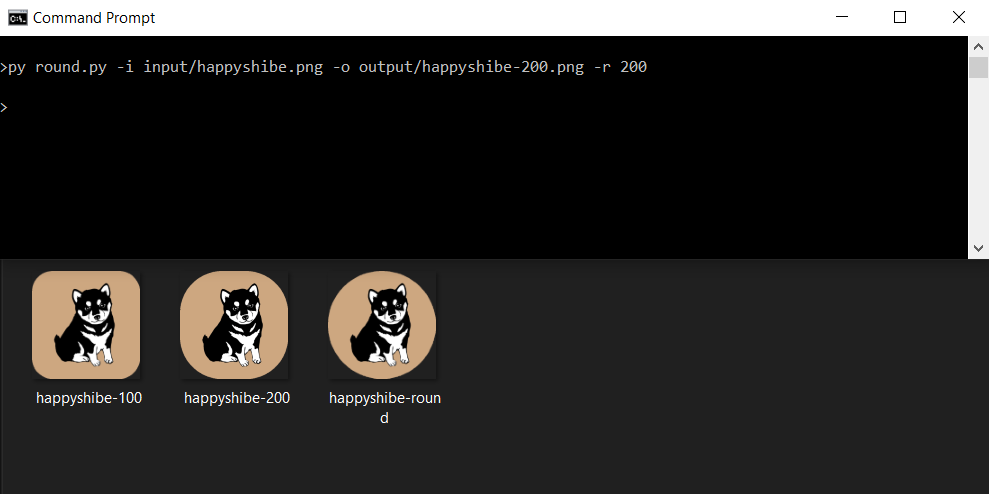
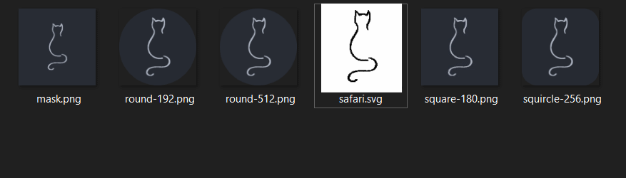

<p float="left">


</p>


# Python.ImageRound


No longer just rounds the corners of an image. Create various icon masks 
and shading effects with the imageEdit library. Three example files: round.py, 
makeProjIcons.py and makePWAImages.py. Includes two tracing components: 
imageTrace.py and imageTracerJs.py. imageTracerJs.py uses JS and is much faster. 
Takes a few seconds and has no cap. (imageTrace.py is capped to 180x180px to 
prevent hanging on test machine. And note that it will take 1-2 mins per trace 
at that resolution)

## Comparison to similar solutions

Similar solutions include but are not limited to:

### GUI
https://www.getpaint.net/

### Web
https://realfavicongenerator.net/

### Advantages of this solution
- Minimal: few dependencies required (python and pillow)
- Quick: when given a regular or mask image it can produce a large number or
variants in a relatively short amount of time
- Customisable: write your own scripts to leverage imageEdit (python knowledge
required)
- Produce a PWA mask icon out of the box
- SVG tracing lib doesn't require potrace/ pypotrace which can be challenging to
set up on Windows
- SVG tracing using imageTracerJs.py (https://github.com/jankovicsandras/imagetracerjs)
is pretty good (requires pyppeteer: https://github.com/miyakogi/pyppeteer)

### Disadvantages of this solution
- Specific image dimensions needed out of the box: whilst this is something that
could be changed, maskable icons are 640x640 and regular icons are 512x512

## How to use out of the box (makePWAImages)

1. Put regular 512x512 image or mask 640x640 image under main/input in this
example I am using lightfox.png


2. Run ```makePWAImages.py``` and navigate to main/output/lightfox.png/pwa


## Download
### Clone
#### Using The Command Line
1. Press the Clone or download button in the top right
2. Copy the URL (link)
3. Open the command line and change directory to where you wish to clone to
4. Type 'git clone' followed by URL in step 2
```bash
$ git clone https://github.com/[user-name]/[repository]
```

More information can be found at
<https://help.github.com/en/articles/cloning-a-repository>

#### Using GitHub Desktop
1. Press the Clone or download button in the top right
2. Click open in desktop
3. Choose the path for where you want and click Clone

More information can be found at
<https://help.github.com/en/desktop/contributing-to-projects/cloning-a-repository-from-github-to-github-desktop>

### Download Zip File

1. Download this GitHub repository
2. Extract the zip archive
3. Copy/ move to the desired location

## Language information
### Built for
This program has been written for Python 3 and has been tested with
Python version 3.8.0 <https://www.python.org/downloads/release/python-380/>.
### Other versions
To install Python, go to <https://www.python.org/> and download the latest
version.
## How to run
1. Open the .py file in vscode
2. Ensure a python 3.8 interpreter is selected (Ctrl+Shift+P > Python:Select Interpreter > Python 3.8)
3. Run by pressing Ctrl+F5 (if you are prompted to install any modules, accept)

## Licence
MIT License
Copyright (c) fredhappyface
(See the [LICENSE](/LICENSE.md) for more information.)


## Screenshots

### Desktop
|Screenshots                                                                                  |
|:-:                                                                                          |
||
||
||
