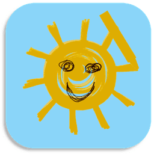

<!--
Note that this is a template, you will need to make changes and complete TODOs

Optional: comment out the code below 
-->

<!--
Built with md.README/build.py by Kieran W.
Find out more at: https://github.com/FredHappyface/md.README

-->

# Python.ImageRound




Round the corners of an image


# Download
## Clone
### Using The Command Line 
1. Press the Clone or download button in the top right
2. Copy the URL (link)
3. Open the command line and change directory to where you wish to clone to
4. Type 'git clone' followed by URL in step 2
```bash
$ git clone https://github.com/[user-name]/[repository]
```

More information can be found at https://help.github.com/en/articles/cloning-a-repository 

### Using GitHub Desktop
1. Press the Clone or download button in the top right
2. Click open in desktop
3. Choose the path for where you want and click Clone

More information can be found at https://help.github.com/en/desktop/contributing-to-projects/cloning-a-repository-from-github-to-github-desktop 

## Download Zip File

1. Download this GitHub repository
2. Extract the zip archive
3. Copy/ move to the desired location


# Language information 
## Built for
This program has been written for Python 3 and has been tested with 
Python version 3.7.0 https://www.python.org/downloads/release/python-370/ 
on a Windows 10 PC. 
## Other versions
To install Python, go to https://www.python.org/ and download the latest version. 
# How to run
1. Open the .py file in IDLE
2. Run by pressing F5 or by selecting Run> Run Module


# Licence 
MIT License
Copyright (c) Kieran W
(See the [LICENSE](/LICENSE.md) for more information.)


<!--
TODO: Add screenshots to readme-assets/screenshots/desktop/ named screenshot-[number].png
-->
# Screenshots 

## Desktop 
|Screenshots|
|:-:|
|  |
|  |
|  | 


# Limited Support
Expect this project to be supported for approximately 6 months (for bug-fixes only).
 Note that this is not guaranteed. Create an issue for bugs
 (as this project is carried out in spare time, you may have 
to wait for a few days)


